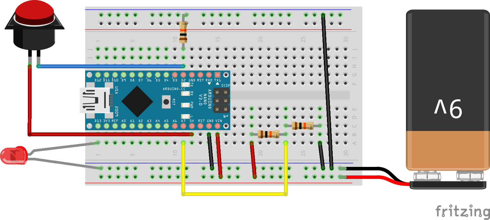

# Cat Timer

This project was built with a knockoff [Arduino Nano](http://www.amazon.com/gp/product/B00UACD13Q), which requires [special drivers](http://kiguino.moos.io/2014/12/31/how-to-use-arduino-nano-mini-pro-with-CH340G-on-mac-osx-yosemite.html).

Modified from [the Arduino Button tutorial](http://www.arduino.cc/en/Tutorial/Button).

## Setup

Requires [`SimpleTimer`](http://playground.arduino.cc/Code/SimpleTimer). The circuit:

* LED attached from pin D2 to ground
* pushbutton attached from pin D12 to +5V
* 10K resistor attached from pin D12 to ground
* Two 10k resistors in series
    * One end goes to Battery - and also to Arduino GND
    * The other goes to Battery + and also to Arduino Vin
    * The middle (connection between two resistors) goes to Arduino A7
* 9V battery connected to Vin and GND

